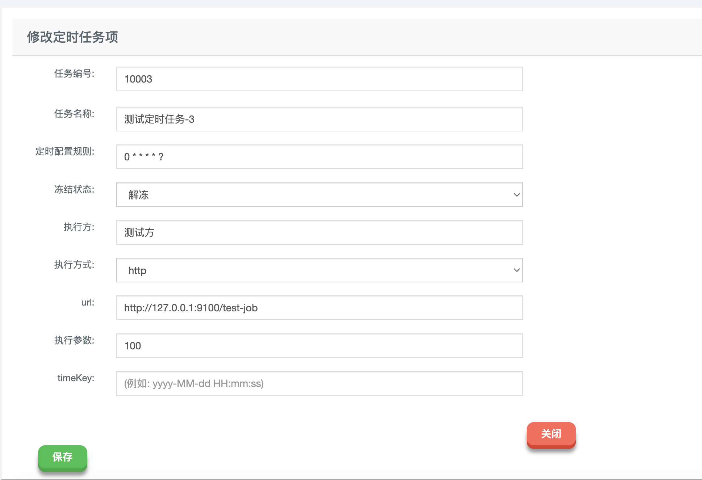

# SpringBoot-quartz-client-starter

## Summary
这是一个Quartz定时任务调度的客户端，已与SpringBoot集成，配合服务端，使用简单的一个注解，就可以创建定时任务。<br>
服务端：[springboot-quartz-demo](https://github.com/simonsfan/springboot-quartz-demo)

## install
使用Maven导入以下依赖
```xml
<dependency>
    <groupId>cn.acmsmu.mgsky1</groupId>
    <artifactId>spring-boot-quartz-client-starter</artifactId>
    <version>1.0.0.2</version>
</dependency>
```

## Configuration

本starter提供以下几个配置项：
```properties
quartz.client.package-scan=com.example.xxx # 要扫描的包
quartz.client.type=standalone # 模式：目前仅支持standalone单体模式
quartz.client.port=9100 # 端口号，默认9100
```

## Usage & Example

### Step1 编写定时任务

定时任务的入口，是一个public方法，支持仅支持一个参数。这个参数支持对象。下面是一个例子
```java
package com.example.xxx;

import cn.acmsmu.mgsky1.quartz.annotation.QuartzClient;

import org.springframework.stereotype.Component;

@Component
public class DemoJob {

    @QuartzClient(value = "test-job")
    public void test(Long minId) {
        System.out.println(minId);
    }
    
}
```
在上面这个例子中，创建了一个名为test-job的定时任务，它由public方法test驱动，有一个Long类型的参数minId，定时任务的功能就是将这个参数打印出来。

⚠️：注意`@QuartzClient`注解，定时任务要由这个注解修饰，其中的属性value，表示定时任务的名称

### Step2 编写配置文件并启动项目
在application.properties中添加以下内容：
```properties
quartz.client.package-scan=com.example.xxx
quartz.client.type=standalone
```

启动项目，当看到以下日志，表示定时任务注册成功
```
METHOD:run[78]: 【quartz-client】: 定时任务配置为:{port=null, type=standalone, packageScan=com.example.xxx}
METHOD:getTargetInvokerModel[109]: 【quartz-client】: 要扫描的定时任务的包名为：com.example.xxx
METHOD:getTargetInvokerModel[163]: 【quartz-client】: 扫描到定时任务：test-job
METHOD:run[102]: 【quartz-client】: 定时任务初始化完毕
```

### Step3 服务端操作

注册定时任务（这里test-job即为注解里定义的定时任务名称，对于任务参数，如果是对象，使用对象的JSON表示即可）



激活定时任务


尝试运行一次定时任务


观察控制台输出：定时任务被执行了


